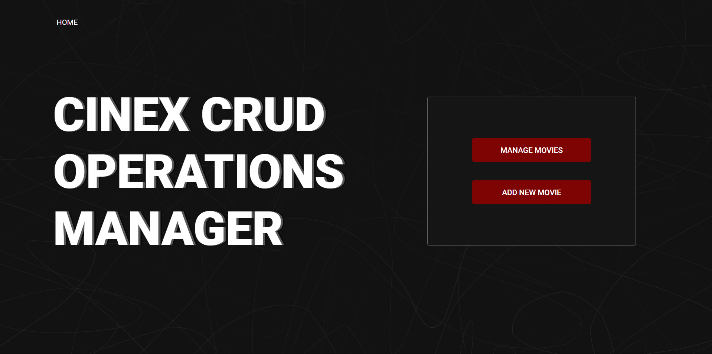

<a id="readme-top"></a>
# CINEX CRUD OPERATIONS MANAGER

<div align="center">
 
 [](https://es.react.dev/)
 [](https://axios-http.com/docs/intro)
 [](https://nodejs.org/en)
 [](https://www.npmjs.com/)
 [](https://expressjs.com/es/)
 [?label=MySQL)](https://www.mysql.com/)
</div>

## About the project

This project is a full-stack web application that enables users to perform Create, Read, Update, and Delete (CRUD) operations on cinema movie entities, the application provides a user-friendly interface for managing movie data such as titles, genres, directors, languages, release dates and more.

<br/>

<div align="center">
 
</div>

## Features
- **Create** new movie entries with details such as Title, Language, Director, Genre, Release date, Running time, MPA age.
- **Read** and display a list of movies, allowing users to view detailed information about each one.
- **Update** existing movie entries to edit attributes such as Title, Language, Release date and MPA age of a specific movie.
- **Delete** movies from the database when they are no longer needed.
- Responsive and intuitive UI for ease of use.
- Real-time interaction with a MySQL database using a REST API.
 
## Getting started

### To get the project running locally:
 - Install Node.js and MySQL
 - Clone the repository
   ```sh
     git clone https://github.com/ALEXUSCR-27/Cinex-Manager.git
     cd Cinex-Manager
   ```
- Install frontend dependencies
  ```sh
  cd frontend
  npm install
  ```
 - Go back and install backend dependencies
   ```sh
   cd ../backend
   npm install
   ```
- Set up the database
  - Create a new MySQL database.
  - Set up the credentials in `index.model.js` server file.
  - Execute`Cinema.sql` script. **(Verify the database name in the script)**
- Run the server
  ```sh
  node server.js
  ```
- Go back to the frontend folder and execute start command.
  ```sh
  cd ../frontend
  npm start
  ```
  ***Important!* Execute frontend and backend in different terminals.**
- Visit `http://localhost:3000` to access the frontend interface.

## Acknowledgments
* [MySQL Installation Guide](https://dev.mysql.com/doc/mysql-installation-excerpt/5.7/en/)
* [How to install Node.js](https://nodejs.org/en/learn/getting-started/how-to-install-nodejs)
* [Getting Started with MySQL](https://dev.mysql.com/doc/mysql-getting-started/en/)

<p align="center"><a href="#readme-top">Back to top ☝🏼</a></p>
